<h1>CHALLENGE NEXT - Globant</h1>

<h3>SOBRE</h3>

A <b><i>Garbage SA</i></b>, empresa de coleta de lixo, está tendo dificuldades logísticas. Ela desconhece aonde o lixo é depositado na região e falta um alinhamento com os residentes sobre o dia e o horário da coleta.

A empresa pede uma solução que junte os participantes, informando os dias e horários estimados para a coleta em tempo real, baseado na posição do caminhão e a rota sugerida.

Este documento ilustra nossa proposta de solução, vamos dividi-lo nos seguintes tópicos:

* <b>(1) Nossa aplicação</b>
* <b>(2) Tecnologias utilizadas</b>
* <b>(3) Navegação entre as telas</b>
* <b>(4) Ideias adicionais</b>
* <b>(5) Como abrir o programa em sua maquina</b>
* <b>(6) Conclusão</b>

<h3>(1) Nossa aplicação</h3>

Desenvolvemos um protótipo em aplicativo de celular `android`. Incluímos dois tipos de usuários: `Clientes`, representando os residentes e `Funcionários`, responsáveis pela coleta.

Dentro da área de cliente, o usuário registra seu nome e a localização da sua residência. O registro fica salvo na memoria corrente da aplicação e pode ser recuperada. Em outras palavras, caso ele tenha salvo seu acesso e voltado para a tela inicial, há a possibilidade de rever os dados, desde que seja informado seu nome cadastrado exato. Também incluímos a possibilidade de edição dos dados, caso o residente deseje.

Já na parte direcionada ao funcionário, incluímos um campo onde ele informa a localização atual do carro de coleta. Para trabalhos futuros podemos alterar essa função para ser automática, contudo deixamos desta forma para demonstrar nossa ideia. O funcionário também pode adicionar uma rota de navegação dependendo se há ou não registro de clientes dentro da aplicação. 

<h5>Relação entre clientes e funcionários:</h5>

Os elementos das telas podem ser alterados conforme um usuário "conversa" com outro. Disponibilizamos abaixo um exemplo de caso de uso da nossa aplicação.

1. Cliente A cria um novo acesso incluindo nome e endereço. 
2. Funcionário B acessa seu portal e insere a localização atual do seu carro de coleta.
3. Funcionário B nota que há um registro de localização do Cliente A para ser adicionada à sua rota.
4. Funcionário B adiciona o endereço do Cliente A em sua rota.
5. Cliente A consulta os seus registros e nota que foi incluída a localização do carro do Funcionário B junto de um aviso informando os dias e o horário estimado que ele vai passar para realizar a coleta.
6. Ao longo do trajeto o Funcionário B vai atualizando sua localização.
7. A todo o momento o Cliente A pode consultar aonde o carro se encontra.
8. O processo vai se repetindo até o Funcionário B ter efetuado a coleta do Cliente A.

Esquema gráfico do caso de uso:

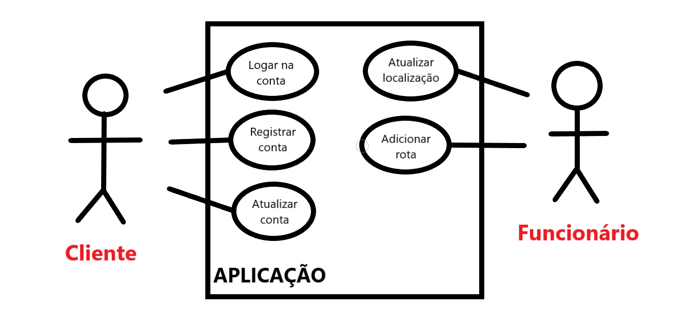

* A ação <i>"Logar na conta"</i> e <i>"Atualizar conta"</i> só serão validas após o cliente ter realizado a ação <i>"Registrar conta"</i>.
* O funcionário sempre pode <i>"Atualizar localização"</i> .
* <i>"Adicionar rota"</i> ficará ativa ao funcionário quando a ação <i>"Registar conta"</i> for acionada.
* Cliente ao <i>"Logar na conta"</i> pode haver ou não a localização do funcionário com os dados para a coleta.
* Independente do funcionário ter disponibilizado ou não sua localização, o cliente nunca irá visualiza-la em seu primeiro acesso, ou seja, quando realiza o <i>"Registrar conta"</i>.

<h3>(2) Tecnologias utilizadas</h3>

Como ferramentas para o desenvolvimento de aplicativos de celulares utilizamos a linguagem `Kotlin` junto com a IDE `Android Studios`. Optamos por esse caminho pois caso o projeto evolua para uma publicação, sentimos mais facilidade nos processos de validação perante a distribuidora `Google Play`. 

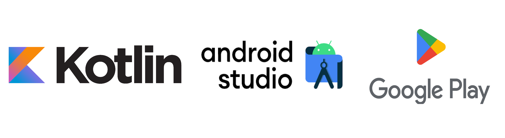

Outra razão para temos escolhido estas ferramentas foi pela gama de `APIs` que disponibilizam. Utilizamos a API do `Google maps` para conseguirmos concretizar os mecanismos de buscas e formação de rotas. Por último mas não menos importante utilizamos as aplicações de design do `Figma` e do `Canva` no planejamento de nossas telas.

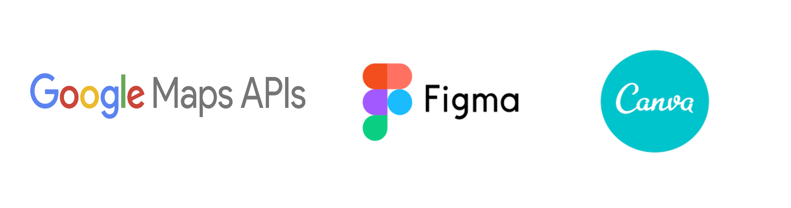

<h3>(3) Navegação entre as telas</h3>

Veja nossa <a href="assets/video_demo.mp4">demonstração</a> em ação.

O processo de navegação das telas foi montado da seguinte forma:

<table><tr><td style="vertical-align:top;font-size:24px"><h5>Tela Inicial:</h5>  Primeira tela a ser apresentada  ao usuário.   Apresentamos o logotipo de nossa  aplicação e os botões de escolha logo  abaixo.  O botão <i>"cliente"</i> leva-o para o portal  do publico alvo do serviço.   Já o botão <i>"funcionário"</i> o levará para o  lado do prestador de serviço da empresa.</td><td style="text-align:right">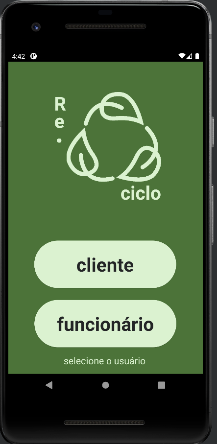<td></tr><tr><td style="vertical-align:top;font-size:24px"><h5>Tela Login:</h5>  Após clicado no botão <i>Cliente</i>,  a aplicação leva o usuário para  o LOGIN, tela que controla  o acesso dos clientes.  Caso o cliente já tenha um registro,  basta digitar o seu nome cadastrado  e clicar no botão <b style="color:red">Start</b> para ter acesso  a conta.   Caso o contrário e o cliente não tenha  conta cadastrada, ele pode realizar  o primeiro acesso clicando em  <i>criar novo usuário</i>.</td><td style="text-align:right">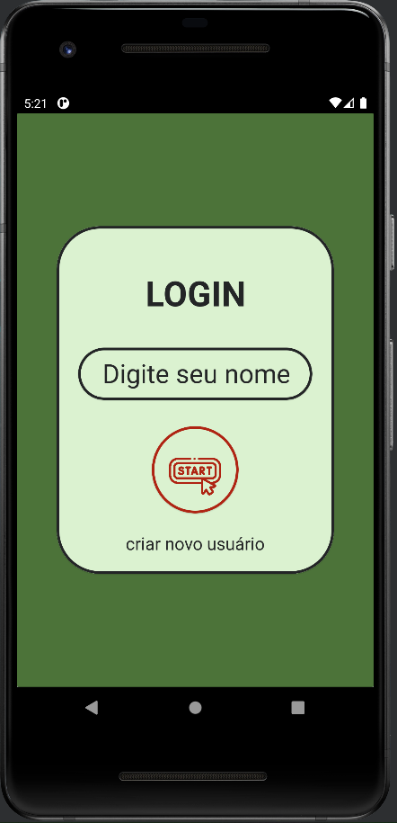<td></tr><tr><td style="vertical-align:top;font-size:24px"><h5>Portal cliente - primeiro acesso:</h5>  Caso o usuário opte em criar uma nova  conta, será monstrado esta tela ao lado  após pressionado o botão <i>Criar novo  usuário</i>.  A tela possui o botão <i>adicionar</i> que vai  registrar o nome e o endereço a  medida que campos logo abaixo  forem preenchidos.   Reparem que na parte inferior da tela   há um mapa em escala continental.  Dependendo do que for colocado  de endereço, este mapa sofrerá  alterações.  Para retorna à tela principal basta  clicar no botão localizado no canto  superior direito.</td><td style="text-align:right">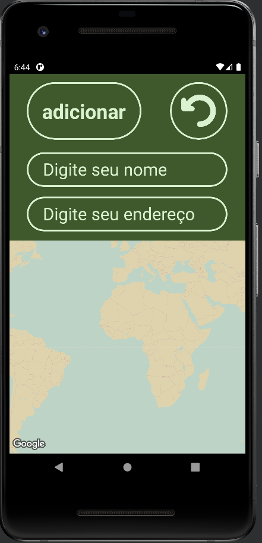<td></tr><tr><td style="vertical-align:top;font-size:24px"><h5>Portal cliente - cadastrado:</h5>  Uma vez os campos sendo preenchidos  e adicionados,  os elementos da tela  são alterados.  O campo que antes era responsável  por receber o nome do usuário agora  o exibi na tela.  A api do google maps pega o dado do  endereço registrado, retornando sua  localização exata no mapa.  O usuário Lucas pode acessar sua  conta quantas vezes quiser desde  que informe seu nome exato no  sistema no momento do LOGIN.</td><td style="text-align:right">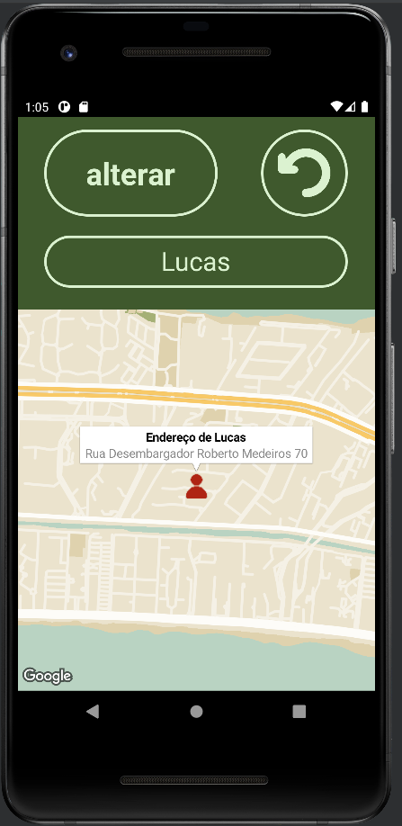<td></tr><tr><td style="vertical-align:top;font-size:24px"><h5>Portal funcionário - primeiro acesso:</h5>  Se voltarmos para a tela inicial e clicarmos  em <i>funcionário</i>, iremos para este portal.   Esta tela é o canal onde o nosso  colaborador recebe os endereços  cadastrados e traça suas rotas.  Podemos notar que o icone do boneco  mostrado na tela anterior foi alterado.  O endereço vira um ponto de coleta  na área do funcionário.  Para o funcionário indicar sua localização  basta preencher o campo acima  e clicar em <i>atualizar</i>.  Lembrando que o comportamento do  mapa pode mudar caso não haja clientes  cadastrados.   Se não existir, o mapa teria  a mesma cara do que foi mostrado na  tela de primeiro acesso do cliente.</td><td style="text-align:right">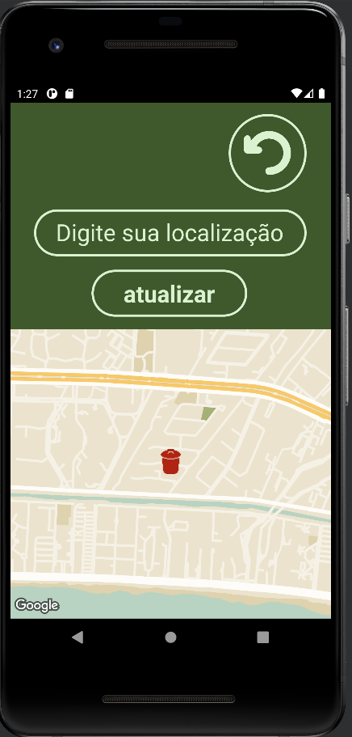<td></tr><tr><td style="vertical-align:top;font-size:24px"><h5>Portal funcionário - cadastrado:</h5>  Quando o funcionário atualiza sua  localização, aparece o seu carro de  coleta no mapa.   Para traçar uma rota além de ter os  endereços de coleta, o funcionário  precisa obrigatoriamente ter  informado sua localização.  Cumprida as condições, para ele  conseguir traçar a rota, é necessário  clicar no ponto de coleta indicado.  Vai aparecer um botão descrito como  <i>adicionar rota</i> após o clique.</td><td style="text-align:right">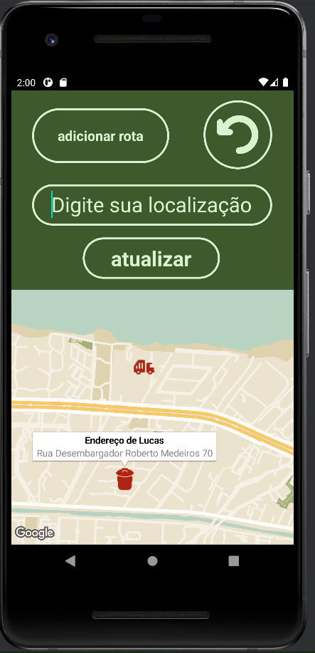<td></tr><tr><td style="vertical-align:top;font-size:24px"><h5>Portal funcionário - com  rota adicionada:</h5>  Ao adicionar a rota, a api directions  do google maps desenha o melhor  caminho para chegar ao ponto  de coleta.  Futuramente podemos desenvolver  uma estimativa de tempo que  o carro leva para chegar ao destino.  Por hora estamos focando no  basico que api disponibiliza.</td><td style="text-align:right">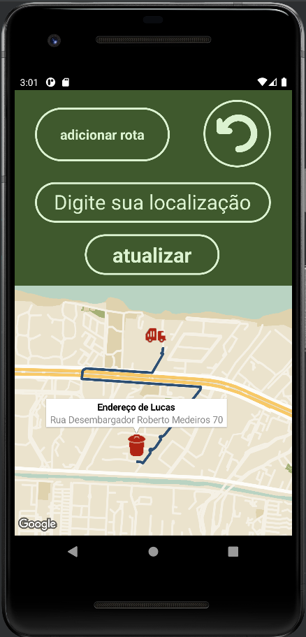<td></tr><tr><td style="vertical-align:top;font-size:24px"><h5>Portal cliente - com recolhimento:</h5>  Se voltarmos para o portal do cliente  já cadastrado, podemos encontrar  novos elementos na tela.  Quando o funcionario oferece sua  localização, apenas os clientes  cadastrados são informados dos  dias e possível horario que o carro  de coleta vai aparecer.  Perceba que também foi incluido  no mapa a localização atual do  carro.   A informação vai atualizando-se  a medida que o funcionário  vai mudando sua posição no portal.   Desta forma o cliente pode  acompanhar em tempo real o serviço  de coleta. </td><td style="text-align:right">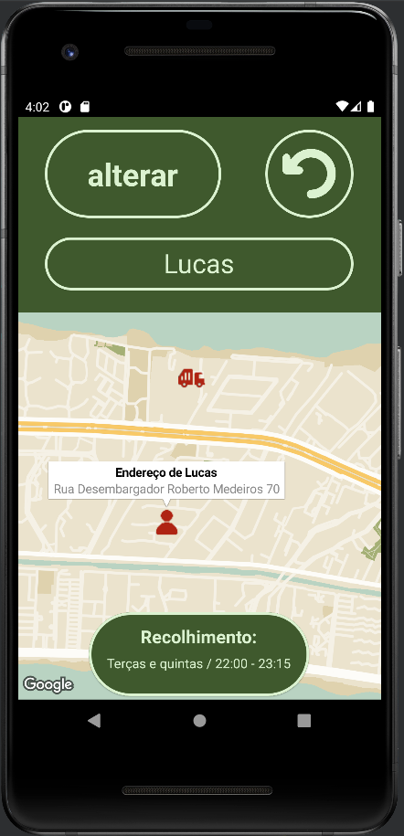<td></tr></table>

<h3>(4) Ideias adicionais</h3>

Temos ciência que apenas o protótipo apresentado acima não vai resolver o problema. Nada garante que as pessoas irão utiliza-lo cegamente no momento do lançamento. Como podemos tornar nossa ideia atrativa para publico?

Pensamos na seguinte ideia: 

* Solicitamos que o usuário nos dê acesso a sua câmera do celular.
* No momento da coleta ele vai precisar confirmar por meio de uma foto que o lixo foi depositado corretamente no ponto de coleta.
* Essas fotos de confirmação irão lhe garantir pontos dentro da aplicação.
* Haverá uma meta á ser atingida, esta representada por uma barra de progresso.
* Conforme o usuário vai confirmando seus depósitos, a barra vai crescendo.
* Quando o progresso for 100%, o usuário ganha pontos de vantagens que podem ser trocados por outros produtos ou serviços (passagens aéreas, compra de eletrodomésticos e etc).
* Para tornar viavel pensamos em chamar orgãos publicos (estados/municipios) para patrocinar essa campanha.

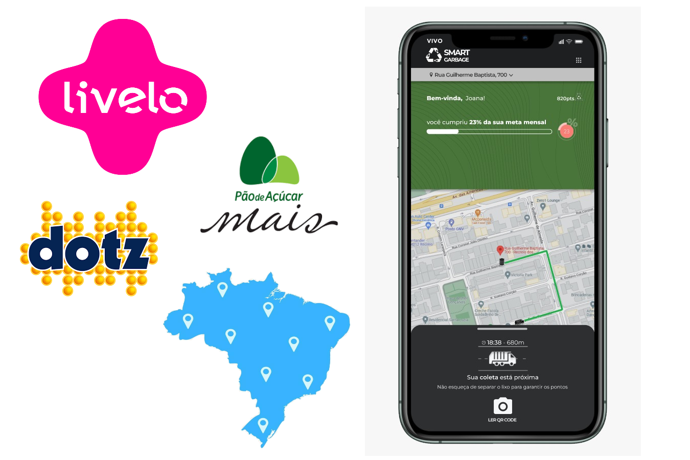

<h3>(5) Como abrir o programa em sua maquina</h3>

Antes de partir para o passo a passo é importante dizer que todo o processo foi desenvolvido utilizando o sistema operacional do `Windows`, portanto vamos mostrar a instalação utilizando este mesmo sistema.  

Siga os seguintes passos para poder rodar o projeto em sua maquina:

1. Entre na página do projeto no <a href="https://github.com/Amorim-cyber/challenger_FIAP_fase5" >github</a>. Clique no botão <i style="color:green" >Code</i> e selecione a opção de realizar o download via arquivo compactado (ZIP).

   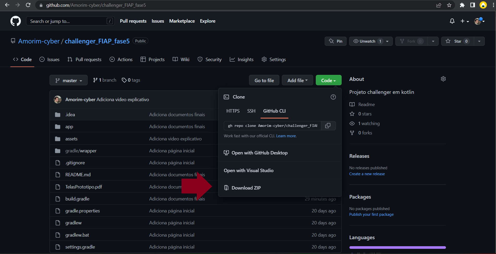

2. O arquivo .zip será baixado e vai aparecer na sua pasta de downloads. Acesse a pasta e clique com o botão direto do mouse e em seguida clique em extrair tudo ou na opção de descompactar dependendo da versão de seu sistema operacional. Fique a vontade para escolher o diretório aonde o arquivo será posto, nesta demonstração vou deixa-lo dentro da pasta de downloads .

   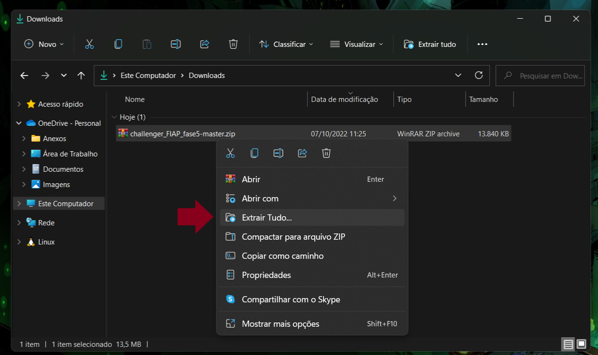

3. Abra o `android studios` ou qualquer outra IDE de sua escolha. Neste caso clique em file no canto direito superior da tela e em seguida em Open... . Vai parece uma tela de busca de arquivos, encontre o caminho aonde foi deixado o arquivo e clique nele para abrir o projeto. Aperte a setinha verde indicada no <i style="color:red">retângulo</i> para iniciar a aplicação. Por nota, pode ser que você precise criar um emulador dependendo da versão do seu android studios. 

   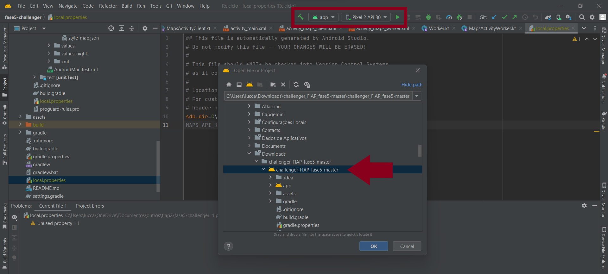

4. Por motivos de segurança não estamos disponibilizando a `api key` do google maps. Para ter um aproveitamento completo da aplicação recomendamos que crie uma api key no <a href="https://developers.google.com/maps/documentation/embed/get-api-key#:~:text=Go%20to%20the%20Google%20Maps%20Platform%20%3E%20Credentials%20page.&text=On%20the%20Credentials%20page%2C%20click,Click%20Close.">google maps plataform</a>. Quando tiver a chave em mãos vai no arquivo <a href="local.properties" >local.properties</a> do projeto e coloque-a na variável `MAPS_API_KEY`. 

   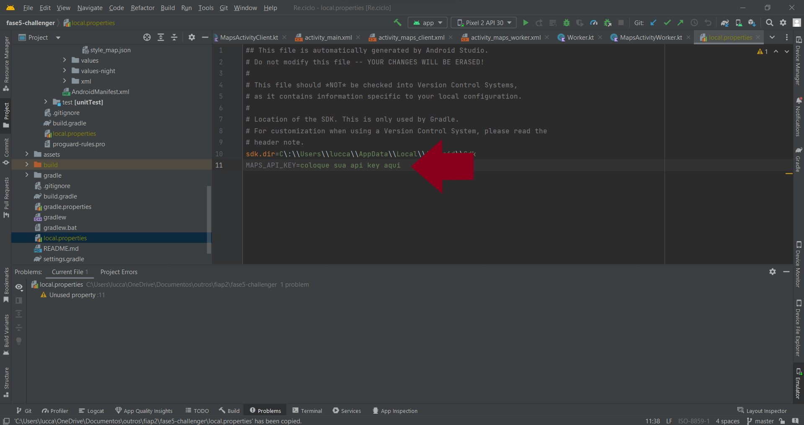

<h3>(6) Conclusão</h3>

Desenvolvemos um prototipo de solução para as determinadas questões:

1. <b>Localizar os pontos de coleta:</b> A medida que os cliente vão se cadastrando na plataforma, a empresa terá as informações sobre aonde coletar.
2. <b>Informar a data e o horário de coleta:</b> No momento que o funcionário sai para fazer a coleta, o cliente terá as informações sobre os dias e horários.
3. <b>Acompanhamento em tempo real:</b>Foi demonstrado de forma manual que conforme o funcionário vai atualizando sua localização, o cliente terá a informação atualizada no momento da consulta.
4. <b>Rota sugerida:</b> Implementamos ferramentas do google maps que traçam a melhor rota entre o funcionário e um determinado ponto de coleta. 

Todos os pontos foram testados e demonstrados no nosso <a href="assets/video_demo.mp4" >vídeo</a> disponível.

Além disso fornecemos uma possível solução para motivar o publico a utilizar o aplicativo. 

Acreditamos que conseguimos cumprir com o que foi proposto pela <b><i>Garbage SA</i></b>.

